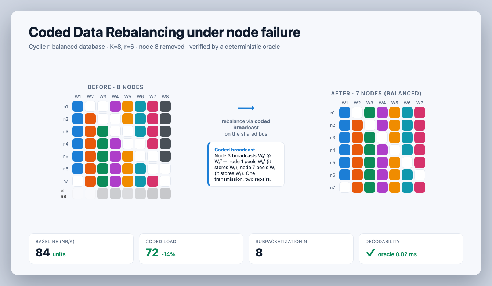

# Coded Data Rebalancing — Verifier-Gated AutoResearch

An autonomous-research control loop for **Coded Data Rebalancing (CDR)**: when a storage
node fails, restore an `r`-replicated, balanced database on the surviving nodes using the
fewest **coded broadcasts**.

**The idea:** creative LLM agents propose schemes, but a **deterministic oracle** verifies
every JSON artifact they emit — placement, split/merge plan, coded repair — against the
non-negotiable invariants (replication = `r`, balanced load, and that every XOR actually
*decodes*). Agents may be arbitrarily creative; **invalid schemes cannot pass the gate.**
That makes the loop's feedback signal trustworthy enough to run autonomously.

> Standout factor: **Agent Architectures & Control Loops** — the oracle is the reward
> signal that makes autonomous research safe and auditable.



*Before → after storage matrices for the cyclic scheme (K=8, r=6, node 8 removed). Every
figure is produced by `src/verifier.py`: coded load 72 vs. baseline 84, and every XOR
verified to decode in 0.02 ms.*

## Quick start

```bash
cd autoresearch
pip install -r requirements.txt        # only the demo UI needs deps; core is pure stdlib

python3 test/test_verifier.py          # the oracle: 18 invariant tests
python3 test/test_core.py              # metrics · Pareto frontier · store · generator
python3 test/test_fixture_cdr_k5.py    # paper Example 1 (arXiv:2001.04939), oracle-verified

streamlit run app.py                   # the demo: one-click "discover" + live verifier gate
python3 viz/make_slide.py              # presentation slide from the verified scheme
```

## What's here

| Path | What |
|------|------|
| `autoresearch/src/verifier.py` | The oracle — placement / plan / repair invariants, exact-integer, zero-dep |
| `autoresearch/src/gate.py` | Hard gate that re-verifies every artifact an agent emits |
| `autoresearch/src/{metrics,pareto,store,generator}.py` | Per-regime metrics, Pareto frontier, persistent store, generator runner |
| `autoresearch/src/orchestrate.py` | Six-agent Codex pipeline (lit-review → placement → plan → repair → fuzzy → judge) |
| `autoresearch/schemas/` | JSON Schemas for the three artifact kinds |
| `autoresearch/test/fixture_*.py` | Two oracle-verified reference schemes from different combinatorial families |
| `autoresearch/app.py` | Streamlit demo (discovery animation + live tamper→reject gate) |
| `autoresearch/viz/` | Presentation slide generator + visualization JSON |
| `cdr_visualizer.py`, `rebalance_*.html` | Standalone cyclic-scheme visualizers |

## How it works

```
Lit Review → Placement → Plan → Repair → Fuzzy Eval → Judge → (next regime)
                  └──────── VERIFIER (oracle) ────────┘   keeps a per-(K,r) Pareto frontier
```

Each `(K, r)` regime is explored in its own branch producing **concrete** artifacts;
different regimes use different scheme families, and the Judge keeps only schemes that are
**non-dominated** over `(communication load, IO reads, subpacketization)`. See
`autoresearch/docs/architecture.md`.

## References

- P. Krishnan, V. Lalitha, L. Natarajan, *Coded Data Rebalancing: Fundamental Limits and
  Constructions*, [arXiv:2001.04939](https://arxiv.org/abs/2001.04939) — the ordered-subset
  scheme is encoded as a verified fixture.
- The cyclic family (lower subpacketization) drives the demo and the slide.

🤖 Built with [Claude Code](https://claude.com/claude-code).
